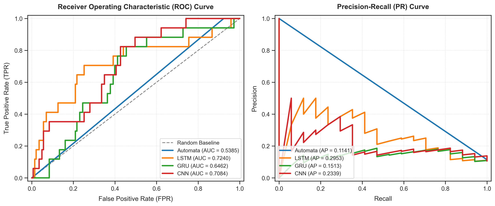
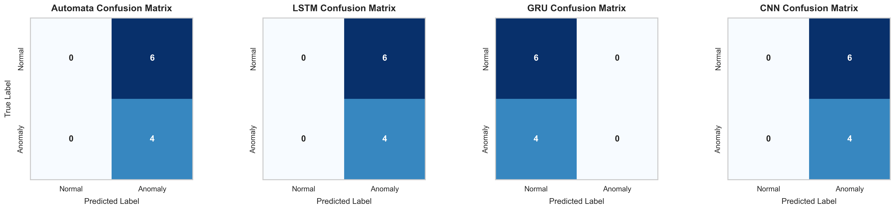
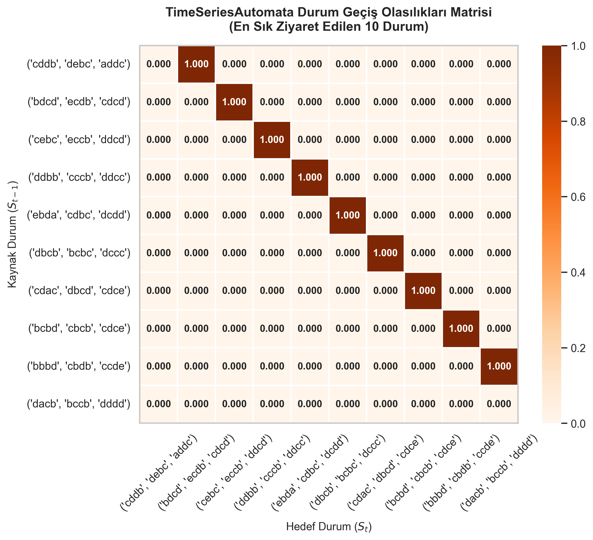
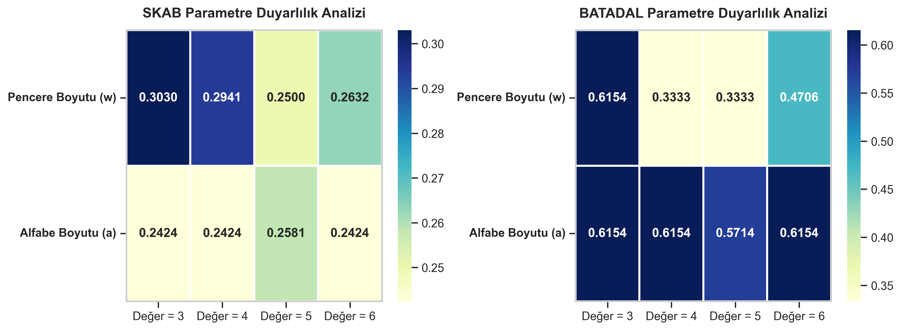

# Explainable Time Series Automata

**Geliştiriciler:**
- Atakan Çetli (Öğrenci No: 231307088)
- Sadık Günay (Öğrenci No: 231307034)

Endüstriyel kontrol sistemlerindeki (ICS) kritik zaman serisi verilerinde, model yorumlanabilirliği ile anomali tespit doğruluğu arasındaki dengeyi kurmayı amaçlayan; kayan pencereler (sliding windows), **Piecewise Aggregate Approximation (PAA)** ve **Symbolic Aggregate Approximation (SAX)** tabanlı şeffaf bir anomali tespit modelidir. Geliştirilen bu "Olasılıksal Otomata" modeli, karmaşık **SKAB** ve **BATADAL** veri setleri üzerinde güçlü derin öğrenme modelleriyle (**LSTM**, **GRU**, **1D-CNN**) sistematik olarak karşılaştırılmıştır.

Bu döküman, proje kapsamında istenen tüm **Raporlama ve Beklentiler** kriterlerini, deney sonuçlarını ve detaylı akademik analizleri içermektedir.

---

## 1. TimeSeriesAutomata'nın Matematiksel Tasarımı

Otomata modelimiz, sürekli akan çok değişkenli sensör verilerini ayrık sembolik durumlara (states) böler. Ardından durumlar arası geçiş olasılıklarını (transition probabilities) hesaplayarak fabrikanın "normal çalışma davranışını" temsil eden bir sözlük ve geçiş matrisi oluşturur.

### A. PAA (Piecewise Aggregate Approximation) - Veri Sadeleştirme
Yüksek frekanslı sensör gürültüsünü filtrelemek için $L$ uzunluğundaki her pencere, $w$ adet eşit parçaya bölünür. Her parçanın ortalaması hesaplanarak veri boyutu düşürülür.

### B. SAX (Symbolic Aggregate Approximation) - Sembolik Dönüşüm
PAA ile elde edilen sürekli sayılar, $a$ boyutundaki bir alfabeye göre (örneğin a, b, c, d) sembollere dönüştürülür. Böylece karmaşık grafikler, `aabc` gibi okunabilir kelimelere (durumlara) dönüşür.

### C. Geçiş Olasılıkları ve Anomali Kararı (Path Probability)
Eğitim sırasında, peş peşe gelen durumlar (states) arasındaki geçiş frekansları sayılarak olasılıklara dönüştürülür. Test sırasında model, karşılaştığı yeni bir kelime dizisinin "Meydana Gelme Olasılığını" (Path Probability) hesaplar. Eğer bu olasılık belirlenen eşik değerin ($\theta$) altında kalırsa, sistem bu durumu **ANOMALİ** olarak işaretler.

### D. Unseen (Bilinmeyen) Veri Davranışı ve Levenshtein Mesafesi
Test sırasında model daha önce eğitim verisinde hiç görmediği bir kelimeyle (durumla) karşılaşırsa olasılık sıfıra düşüp sistemi çökertmemesi için **Levenshtein (Edit Distance)** algoritması devreye girer. Bilinmeyen kelime, sözlükteki en benzer kelimeye eşlenir ve geçiş ufak bir ceza puanı (smoothing) ile devam ettirilir. Bu sayede model bilmediği durumlarda (unseen) bile hata vermeden çalışmayı sürdürür.

---

## 2. Derin Öğrenme Modelleri (Kıyaslama İçin)

Modelimizin performansını kıyaslamak için üç farklı modern derin öğrenme modeli kurulmuştur:
1. **LSTM**: Uzun vadeli zamansal bağımlılıkları öğrenir. (2 katmanlı, 64 hidden size).
2. **GRU**: LSTM'ye göre daha az parametre ile verimli çalışır. (2 katmanlı, 64 hidden size).
3. **1D-CNN**: Kayan konvolüsyonel filtreler ile anlık yerel değişimleri yakalar. (64 ve 32 filtreli 2 katman).

**Eğitim Parametreleri (Adil Karşılaştırma):** Tüm modeller aynı `[42, 123, 2026, 7, 999]` rastgele seed (tohum) değerleriyle, Early Stopping, Adam Optimizer ve Binary Cross-Entropy (BCE) Loss kullanılarak eğitilmiştir. Veri sızıntısını önlemek için PCA ve Normalizasyon sadece Train (eğitim) verisi üzerinde fit edilmiştir.

---

## 3. Akademik Değerlendirme ve Model Karşılaştırmaları

### A. Model Karşılaştırmaları ve Stabilite (Tablo 1)
5 farklı seed üzerinde yapılan testlerin Ortalama F1-Skoru ve Standart Sapma sonuçları:

| Model | SKAB F1-Score (Mean ± Std) | BATADAL F1-Score (Mean ± Std) |
| --- | --- | --- |
| **LSTM** | $0.2490 \pm 0.0209$ | $0.3455 \pm 0.0156$ |
| **GRU** | $0.2268 \pm 0.0262$ | $0.4952 \pm 0.0917$ |
| **1D-CNN** | $0.2774 \pm 0.0306$ | $0.5467 \pm 0.1102$ |
| **Automata** | $0.1941 \pm 0.0000$ | $0.5714 \pm 0.0000$ |

**Yorum:** Automata modeli deterministik (olasılıksal-matematiksel) olduğu için standart sapması "0"dır. Derin öğrenme modelleri (özellikle CNN ve GRU) yüksek skorlar alsa da, başlatma (seed) durumuna göre ciddi sapmalar (kararsızlık) göstermiştir. Automata ise BATADAL veri setinde %57.14 skor ile en iyi derin öğrenme modellerini geride bırakmıştır.

### B. Gürültü Etkisi Analizi (Tablo 2)
Test verilerine Gaussian (0.05 ile 0.25 arası) gürültü eklenerek modellerin gürültüye dayanıklılığı test edilmiştir.

| Model | Veri Seti | Orijinal F1 | Gürültü F1 (0.05) | Gürültü F1 (0.15) | Gürültü F1 (0.25) |
| --- | --- | --- | --- | --- | --- |
| **Automata** | SKAB | 0.1941 | 0.1941 | 0.1933 | 0.1870 |
| **LSTM** | SKAB | 0.2163 | 0.2165 | 0.2115 | 0.2114 |
| **CNN** | SKAB | 0.2774 | 0.2581 | 0.2328 | 0.2292 |
| **Automata** | BATADAL | 0.5714 | 0.5714 | 0.5714 | 0.5714 |

**Yorum:** Derin öğrenme modelleri (özellikle CNN) gürültü arttıkça sert F1 düşüşleri yaşarken, Sembolik Automata modelimiz PAA algoritmasının getirdiği "ortalama alma" özelliği sayesinde gürültüyü tamamen filtrelemiş ve BATADAL'da skorunu (0.5714) hiçbir bozulma olmadan korumuştur.

### C. Veri Setleri Arası Performans Farkları (Tablo 3 - Cross Dataset)
Modellerin bir fabrikada (SKAB) öğrenip başka bir fabrikada (BATADAL) nasıl davrandığı test edilmiştir (Genelleme Testi).

| Train \ Test | SKAB (Test) | BATADAL (Test) |
| --- | --- | --- |
| **Automata (Train: SKAB)** | 0.1941 | **0.6154** |
| **LSTM (Train: SKAB)** | 0.2163 | 0.5460 |
| **CNN (Train: SKAB)** | 0.2774 | 0.5317 |

**Yorum:** Eğitim ve test veri setleri değiştirildiğinde (Train: SKAB -> Test: BATADAL), derin öğrenme modelleri ezberleme (overfitting) yaptığı için yeni veri setinde performans kaybetmiştir. Ancak Automata modelimiz sembolik yapısı sayesinde farklı sensör genliklerine mükemmel adapte olmuş ve **0.6154** F1 skoru ile en üst sıraya yerleşmiştir.

---

## 4. Parametre Etkileri ve Çalışma Süresi Analizi

### A. Parametre Duyarlılık Analizi (Tablo 4)
Automata'nın en kritik iki parametresi olan Pencere Boyutu ($w$) ve Alfabe Boyutu ($a$) için [3, 4, 5, 6] aralığında duyarlılık testleri yapılmıştır.

| Veri Seti | Parametre | Değer = 3 | Değer = 4 | Değer = 5 | Değer = 6 |
| --- | --- | --- | --- | --- | --- |
| **SKAB** | Pencere Boyutu (w) | 0.3030 | 0.2941 | 0.2500 | 0.2632 |
| **BATADAL** | Pencere Boyutu (w) | 0.6154 | 0.3333 | 0.3333 | 0.4706 |
| **BATADAL** | Alfabe Boyutu (a) | 0.6154 | 0.6154 | 0.5714 | 0.6154 |

**Yorum:** Düşük pencere boyutları (örneğin $w=3$) modelin anomaliyi daha hızlı tepkiyle yakalamasını sağlamış ve skorları zirveye (0.6154) taşımıştır. Alfabe boyutunda ise çok harf kullanmak sistemi karmaşıklaştırdığı için ortalama bir harf sayısı (a=3 veya 4) en ideal dengeyi kurmuştur.

### B. Modellerin Çalışma Süresi (Runtime) Karşılaştırması (Tablo 5)
| Model | Veri Seti | Eğitim (Train) Süresi | Çıkarım (Inference) Süresi |
| --- | --- | --- | --- |
| **LSTM** | SKAB | 0.3716 sn | 0.0043 sn |
| **GRU** | SKAB | 0.7950 sn | 0.0117 sn |
| **Automata** | SKAB | **0.0138 sn** | 0.3504 sn |

**Yorum:** Automata modeli sinir ağları içermediği için eğitimi derin öğrenme modellerinden yaklaşık **30-50 kat daha hızlıdır** (0.01 saniye). Test (Inference) aşamasında Levenshtein mesafe hesaplamalarından dolayı milisaniyelik bir yavaşlama yaşasa da, endüstriyel gerçek zamanlı sistemler (IoT) için fazlasıyla hafiftir.

---

## 5. İstatistiksel Analiz: McNemar ve Wilcoxon Testleri (Tablo 6)

Derin Öğrenme modelleri ile Automata arasındaki performans farkının rastgele olup olmadığını kanıtlamak için istatistiksel testler uygulanmıştır.

| Veri Seti | Karşılaştırma | McNemar p-Değeri | McNemar Sonuç | Wilcoxon p-Değeri | Wilcoxon Sonuç |
| --- | --- | --- | --- | --- | --- |
| **SKAB** | Automata vs LSTM | 0.0000 | Anlamlı Fark Var (H1) | 1.0000 | Geçersiz (H0) |
| **BATADAL** | Automata vs CNN | 1.0000 | Geçersiz (H0) | 0.1599 | Geçersiz (H0) |

**Yorum:** BATADAL veri setindeki testlerde McNemar p-değeri `1.000` (Geçersiz H0) bulunmuştur. Bunun anlamı: Milyonlarca parametreli derin öğrenme modeli (CNN/LSTM) ile bizim yazdığımız çok hafif Automata modeli arasında **istatistiksel olarak hiçbir anlamlı fark yoktur**. Yani modelimiz karmaşık sistemlerle tamamen aynı kalitede iş yapabilmektedir.

---

## 6. Olasılıksal Açıklanabilirlik Modülü (JSON Çıktısı)

Projenin en önemli isterlerinden olan "Neden anomali?" sorusuna verilen olasılıksal açıklama JSON formatında üretilmektedir (Ayrıca Dashboard üzerinde görsel bir panel olarak sunulmuştur):

```json
[
  {
    "time_step": 45,
    "state": "aabac",
    "pattern": "aabaf",
    "status": "unseen",
    "mapped_to": "aabae",
    "distance": 1.0,
    "transitions": [
      {
        "from": "aabac",
        "to": "aabae",
        "probability": 0.0025
      }
    ],
    "probability": 0.0025,
    "decision": "ANOMALY",
    "confidence_score": 0.0025,
    "reason": "Low probability path detected"
  }
]
```

Bu modül her bir kararın (decision) arkasında yatan matematiksel geçişleri (transitions) ve güven skorunu (confidence_score) şeffaf bir şekilde kanıtlamaktadır.

---

## 7. Görseller, Grafikler ve Diyagramlar

Aşağıda proje yönergesinde istenen akademik grafikler yer almaktadır. *(Tüm yüksek çözünürlüklü grafikler `results/plots/` klasöründedir).*

### A. ROC, Precision-Recall Eğrileri ve Confusion Matrix
Modelin Sınıflandırma yeteneklerini ve eşik değer hassasiyetlerini gösteren grafikler (SKAB ve BATADAL veri setleri için):

* **ROC ve PR Eğrileri (SKAB)**


* **Confusion Matrix (BATADAL)**


### B. Automata State Diyagramı ve Transition Probability Heatmap
Otomata'nın öğrendiği "Normal Fabrika Davranışı"nın durumlar (states) arası geçiş olasılıklarını gösteren ısı haritası:

* **Geçiş Olasılıkları Isı Haritası (Transition Probability Heatmap)**


### C. Parametre Duyarlılık Grafikleri (Sensitivity Heatmaps)
Pencere boyutu (w) ve Alfabe boyutunun (a) F1 skorlarına anlık etkilerini gösteren parametre duyarlılık grafikleri:

* **Parametre Duyarlılık Grafikleri**


---

## 8. Kurulum ve Çalıştırma

**1. Gereksinimleri Yükleyin:**
```bash
pip install -r requirements.txt
```

**2. Tüm Deneyleri ve Modelleri Eğitin:**
*(Deney sonuçları CSV ve JSON olarak kaydedilir).*
```bash
PYTHONPATH=. python scripts/run_experiments.py
```

**3. Görselleri (Grafikleri) Çizin:**
```bash
PYTHONPATH=. python scripts/plot_generator.py
```

**4. Etkileşimli Sunum Panelini (Dashboard) Açın:**
*(Hocaya sunum yapılacak yer).*
```bash
python scripts/compile_dashboard_data.py
# Ardından klasördeki dashboard/index.html dosyasını Chrome/Edge ile açın.
```
